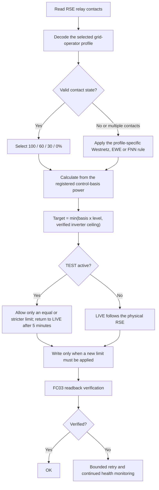
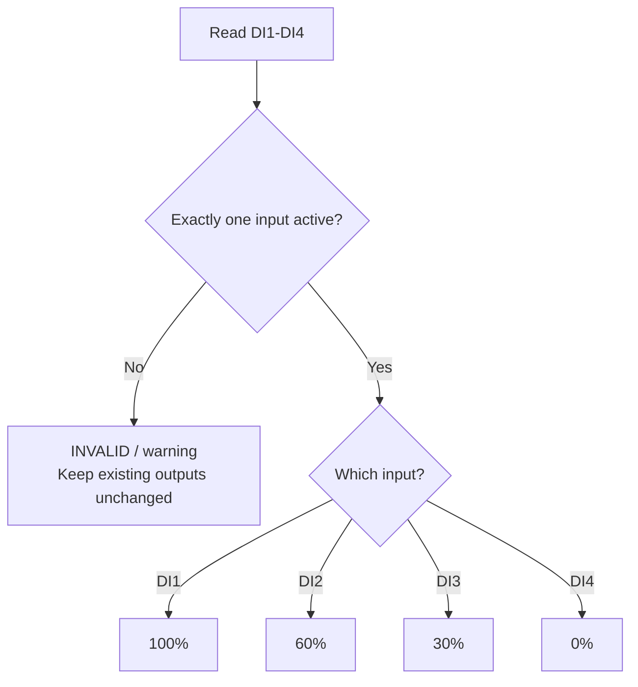
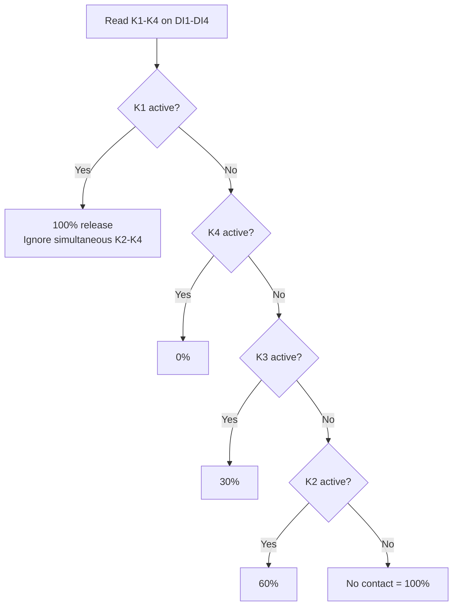
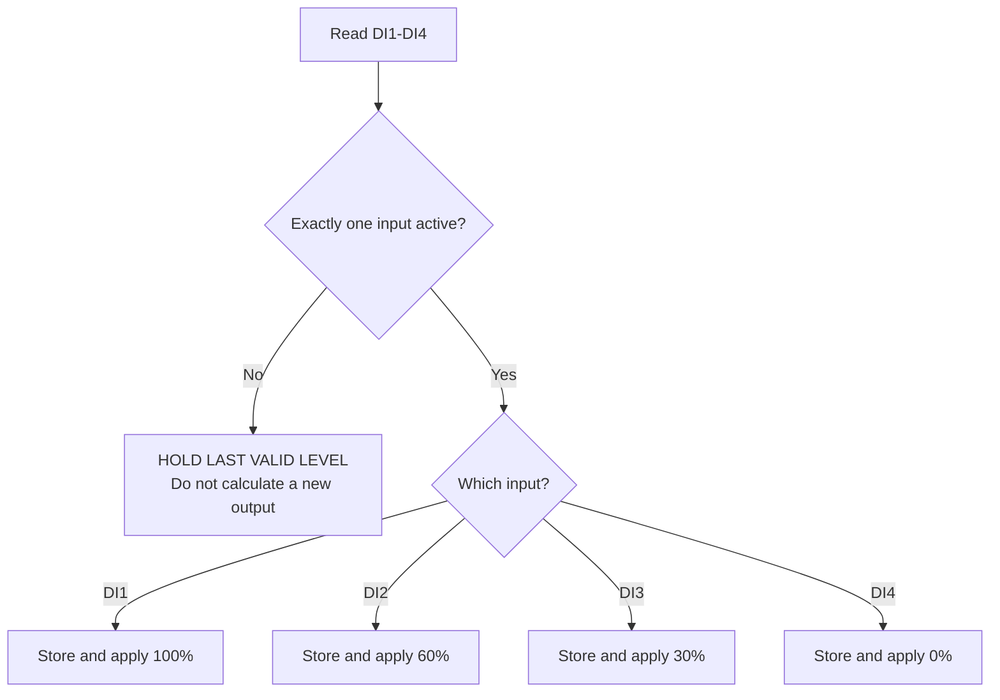
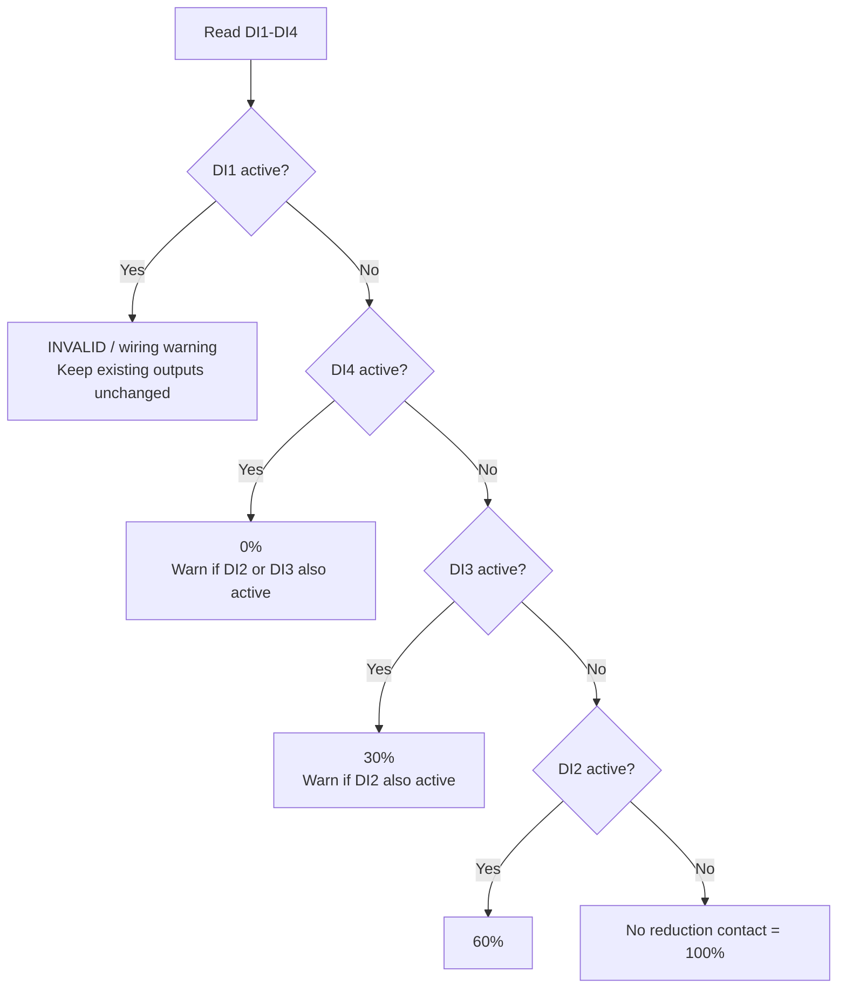

# 14a Bridge

[Deutsch (Standard)](README.md) · **English** · [繁體中文](README.zh-TW.md)

Firmware and a Windows USB Configurator for using an M5Stack StampPLC as a
bridge between a ripple-control receiver (`Rundsteuerempfänger`, RSE) and up to
six Modbus RTU inverters.

The RSE decodes the grid operator's signal. The StampPLC reads its
potential-free relay contacts, selects the required feed-in level and writes an
individually calculated watt limit to inverter IDs 2-7. Every write is followed
by an FC03 readback verification.

> **Scope:** this product controls PV feed-in under EEG requirements and the
> selected distribution system operator's relay table. EnWG §14a primarily
> concerns controllable consumption devices such as heat pumps, EV chargers and
> storage. This project is not a legal certification and does not replace the
> responsible grid operator's written connection requirements.

[Download the latest release](https://github.com/tatsuo25103/14a-bridge/releases/latest)
· [Detailed firmware documentation](stamplc_14a_bridge/README.md)
· [English quick start](stamplc_14a_bridge/docs/QUICK_START_en.md)

## Verified compatible equipment

- M5Stack StampPLC
- FSP PowerManager Hybrid 10 kW
- FSP PowerManager Hybrid 15 kW
- RSE with potential-free relay contacts and a site-approved contact table

Other Modbus RTU inverters require register, data-width and control-behavior
validation before use.

## System overview




## Supported RSE profiles

Select the profile specified by the responsible distribution system operator.
Do not choose a profile by trial and error.

| GUI profile | Inputs | No active contact | Multiple active contacts |
|---|---|---|---|
| Strict 4-contact (legacy) | DI1/2/3/4 = 100/60/30/0% | Invalid; output unchanged | Invalid; output unchanged |
| Westnetz 4-contact | DI1/2/3/4 = K1/K2/K3/K4 | 100% | K1 releases 100%; otherwise the strongest reduction applies |
| EWE 4-contact (hold last) | DI1/2/3/4 = 100/60/30/0% | Hold the last valid level | Hold the last valid level |
| VDE FNN / Netze BW 3-contact | DI2/3/4 = 60/30/0%; DI1 unused | 100% | Strongest reduction applies and a warning is logged |

Westnetz explicitly states that K1 releases full feed-in even during a
temporary overlap. If K1 is not active, the contact requesting the strongest
reduction applies. EWE instead requires the plant to retain the last valid
level when more than one or no level relay is active. These rules are not
interchangeable.

### Strict 4-contact (legacy) flow

Exactly one contact must be active. Any all-open or overlapping state is
invalid and leaves the existing inverter limits unchanged.



### Westnetz 4-contact flow

K1 is an explicit full-feed-in release and has priority during a temporary
relay overlap. Without K1, the contact requesting the strongest reduction
wins. An all-open state releases 100%.



### EWE 4-contact (hold last) flow

EWE accepts only one active level relay. If no relay or more than one relay is
active, the last valid setpoint remains in force.



### VDE FNN / Netze BW 3-contact flow

DI1 is unused and must remain inactive. DI2, DI3 and DI4 request 60%, 30% and
0%. No reduction contact means 100%. If reduction contacts overlap, the
strongest reduction is applied and the overlap is logged as a warning.



## Feed-in calculation

For each enabled inverter:

```text
target W = min(registered control-basis W x RSE percentage,
               verified inverter rated maximum W)
```

Example: 18 kW installed PV control basis with a verified 15 kW inverter:

| RSE level | Basis calculation | Inverter target |
|---:|---:|---:|
| 100% | 18,000 W | 15,000 W |
| 60% | 10,800 W | 10,800 W |
| 30% | 5,400 W | 5,400 W |
| 0% | 0 W | 0 W |

Enter the value accepted by the grid operator as `P_inst`, `P_AV` or the
registered control basis. The inverter rating is a separate physical ceiling;
it must not replace the PV/control basis used for the percentage calculation.

## Control and compliance map

The table deliberately separates mandatory rules from operator-specific rules
and MES reliability measures.

| Function or logic | Implemented behavior | Requirement or design basis | Classification |
|---|---|---|---|
| Remote feed-in control | Converts the physical RSE state into an inverter limit | [EEG §9(1) no. 2](https://www.gesetze-im-internet.de/eeg_2014/__9.html): the grid operator must be able to retrieve actual feed-in and remotely regulate feed-in completely or, where technically possible, stepwise or continuously | Statutory requirement |
| Remote reduction for 25 to below 100 kW | Provides a remotely controllable reduction interface | [EEG §9(2), sentence 1, no. 2(a)](https://www.gesetze-im-internet.de/eeg_2014/__9.html) | Statutory requirement |
| 100/60/30/0% stages | Decodes four fixed feed-in levels | [EWE technical requirements, section 1.2/table 1](https://www.ewe-netz.de/~/media/ewe-netz/downloads/2021_02_05_eisman_dokument_25-100kw.pdf) and [Westnetz TAB, section 5.7.4.2.1](https://www.westnetz.de/content/dam/revu-global/westnetz/documents/fuer-partnerfirmen/strom-infothemen-fuer-installationsunternehmen/tab-ns-westnetz-190430.pdf) | Grid-operator rule |
| Potential-free relay inputs | Reads the RSE contacts through StampPLC digital inputs | EWE section 1.2 and Westnetz section 5.7.4.2.1 specify potential-free changeover contacts | Grid-operator rule |
| Westnetz overlap handling | K1 has 100% priority; without K1, the strongest reduction applies; no relay means 100% | [Westnetz TAB, page 38 / section 5.7.4.2.1](https://www.westnetz.de/content/dam/revu-global/westnetz/documents/fuer-partnerfirmen/strom-infothemen-fuer-installationsunternehmen/tab-ns-westnetz-190430.pdf) | Grid-operator rule |
| EWE invalid/overlap handling | Holds the last valid value if zero or multiple level relays are active | [EWE technical requirements, section 1.2, note](https://www.ewe-netz.de/~/media/ewe-netz/downloads/2021_02_05_eisman_dokument_25-100kw.pdf) | Grid-operator rule |
| FNN three-contact mode | DI2/DI3/DI4 request 60/30/0%; no reduction contact releases 100% | [VDE FNN interface guidance, section 6.1 / figure 7](https://www.vde.com/resource/blob/2352664/6599b9aad89846ca5f668ad5f4fc9e64/vde-fnn-hinweis-schnittstellen-steuerungseinrichtung-data.pdf) | Interface guidance |
| Prompt command execution | Starts processing immediately after the debounced command is valid | EWE section 2.2 requires the setpoint without delay and within one minute at the latest | Grid-operator rule |
| Percentage control basis | Calculates the requested stage from the registered installed/control-basis power | [EEG §3 no. 31](https://www.gesetze-im-internet.de/eeg_2014/__3.html) defines installed power; EWE table 1 states that its stages refer to installed power; Westnetz specifies `P_AV` | Statutory definition plus operator rule |
| One bridge for several inverters | Distributes one valid command to enabled IDs 2-7 | [EEG §9(2)](https://www.gesetze-im-internet.de/eeg_2014/__9.html) permits one common technical device for qualifying plants using the same energy source at one grid connection point. Westnetz requires prior coordination when one RSE is assigned to several generating plants | Conditional; confirm with grid operator |
| TEST cannot release a physical reduction | A GUI test may request only the same or a lower output than the physical RSE | Prevents commissioning from bypassing the grid operator's command | MES safety design |
| Five-minute TEST timeout | Automatically returns to the physical RSE; an RSE transition or **Enable LIVE** ends TEST immediately | Prevents a temporary commissioning value from being forgotten | MES safety design |
| Write only on a required control action | Does not continually rewrite an unchanged setpoint | Reduces unnecessary inverter non-volatile writes | MES reliability design |
| FC03 readback after FC16 | Verifies that every new limit was accepted | Detects an unsuccessful or clamped write | MES reliability design |
| Bounded retries | Retries a failed control transaction only a finite number of times | Prevents unbounded bus traffic or inverter writes | MES reliability design |
| Strict ERROR qualification | Uses warning/CHECK states for transient misses and requires repeated failure before a red ERROR state | Avoids false failures from a single RS485 disturbance | MES reliability design |
| Periodic health read | Continues read-only checks and clears the fault after communication recovers | Supports the proper technical operating state required by EEG §9(1); the exact interval is an MES implementation choice | MES reliability design |
| Safe OTA gate | Automatic OTA requires a valid clock, the configured maintenance window, a stable physical 100% release, LIVE mode, idle Modbus control and all enabled inverters ready. The checks continue during download and abort installation if the RSE changes | Prevents maintenance from interfering with an active reduction or inverter transaction | MES safety design |
| Default non-daylight OTA period | Automatic OTA is off by default. When enabled, its default local maintenance window is **01:00-01:59 Europe/Berlin**, selected as a non-daylight operating period. A missed or unsafe window waits until the next day. The GUI may change the scheduled time for site requirements | Reduces the operational impact of firmware maintenance | MES safety design |
| Signed OTA and rollback | Accepts only an ECDSA-signed manifest and matching SHA-256 image; first boot is validated with rollback support | Protects firmware integrity and recovery | MES security design |
| Preserved configuration | Keeps inverter, PV, RS485, Wi-Fi, RSE-profile and OTA settings across compatible updates | Prevents an update from silently changing commissioned operation | MES safety design |

## OTA behavior

Automatic OTA is disabled until the installer explicitly enables it. The
default schedule is `01:00-01:59` Europe/Berlin, intentionally selected as a
non-daylight maintenance period. Wi-Fi/NTP synchronizes the onboard RTC after
startup and once per day.

An automatic installation starts only when all conditions are true:

- the RTC is valid and the configured 60-minute maintenance window is active;
- the physical RSE inputs are stable and decode to 100%;
- the controller is in LIVE, not TEST;
- no Modbus write/readback transaction is in progress;
- every enabled inverter is verified and ready;
- Wi-Fi and the signed update source are available.

The controller repeats its safety check during the download. If an RSE change
or another unsafe condition occurs, the update is aborted and the running
firmware remains active. An unsafe or missed window is not moved into daytime;
automatic OTA waits for the next scheduled day.

The configurable time is a maintenance setting, not an astronomical
sunrise/sunset calculation. Keep it in a verified non-daylight period for the
installation location.

### Local firmware rollback

After a successful OTA first-boot validation, the controller records the exact
previous partition and binds it to the firmware's ELF SHA-256. Hold **A+C for
five seconds** while leaving B released to request rollback. A circular LCD
countdown shows the remaining time; pressing B cancels and locks the gesture
until all buttons are released.

Rollback is accepted only at stable physical 100%, LIVE mode, idle Modbus and
with all enabled inverters verified at target. Missing, stale or overwritten
backups are rejected without reboot. After a successful rollback, automatic
OTA is disabled so the rejected version is not immediately reinstalled.

## Quick start

1. Install the latest Windows package from [Releases](https://github.com/tatsuo25103/14a-bridge/releases/latest).
2. Connect the StampPLC by USB-C and start **14a Bridge - USB Configurator**.
3. Click **Scan**. The GUI identifies compatible StampPLC ports and connects; multiple devices remain selectable.
4. Open **Settings**, select the grid-operator RSE profile and configure inverter IDs 2-7.
5. Enter the registered PV/control-basis power for each enabled inverter.
6. Run **First-time discovery** only during commissioning, while the physical RSE is valid 100% or not yet installed. Review every detected inverter rating before saving.
7. Save settings, then open **Commissioning** and test 100%, 60%, 30% and 0% under supervision.
8. Click **Enable LIVE** and verify the physical RSE transitions and FC03 readbacks.

## GUI controls


| Control | Purpose |
|---|---|
| **Scan** | Sends read-only identity requests to serial ports. One SmartPLC connects automatically; multiple SmartPLCs remain selectable. |
| **First-time discovery** | Read-only scan of IDs 2-7. Presets detected inverter ratings but does not save them. Use only during initial commissioning at physical 100% or before the RSE is installed. |
| **Save inverter settings** | Saves enabled IDs, installed PV/control-basis power, verified inverter ceiling, RS485 settings and RSE profile. Offline units remain pending instead of losing the entered configuration. |
| **Read SmartPLC settings** | Reloads all saved controller settings and status. Use before editing and after saving. |
| **Refresh PC Wi-Fi** | Reloads Wi-Fi profile names available on the PC. Manual SSID entry remains possible. |
| **Save connect** | Stores Wi-Fi credentials in the SmartPLC and starts connection. |
| **Retry connection** | Retries the saved Wi-Fi without changing credentials. |
| **Enable automatic OTA** | Enables the scheduled SmartPLC firmware check. The default maintenance window is 01:00-01:59 Europe/Berlin. |
| **Save OTA time** | Changes the beginning of the daily 60-minute maintenance window. Keep it in a verified non-daylight period. |
| **Sync clock from PC** | Sets the onboard RTC. Wi-Fi/NTP later synchronizes it automatically. |
| **USB flash V1.0.7** | Installs the bundled bootloader, OTA partition layout and firmware, with progress and verification. |
| **Check SmartPLC update** | Checks the signed SmartPLC firmware manifest. If a newer version exists, the GUI asks before installation. |


| Control | Purpose |
|---|---|
| **100% / 60% / 30% / 0% test** | Applies a supervised temporary setpoint. TEST cannot relax a stricter physical RSE request and expires after five minutes. |
| **Enable LIVE** | Cancels TEST immediately and returns to the actual physical RSE input. |
| **Live display** | Dashed line = RSE target; liquid fill = verified inverter readback; red frame = qualified fault. |
| **Device event log** | Shows commands, readbacks, retries, recovery, OTA and diagnostic events. |

## Basic wiring

Only use the shown direct DI wiring with **potential-free RSE contacts**.
Never connect a switched 230 V signal directly to a StampPLC 5-36 V DC input.
Use a correctly rated isolation/interface relay where required.

```text
12 V DC supply
  +12 V ---------------- StampPLC VIN+
   0 V ---------------- StampPLC VIN-/GND and input COM

RSE potential-free contacts
  relay common --------- +12 V
  K1 / 100% ------------ DI1
  K2 /  60% ------------ DI2
  K3 /  30% ------------ DI3
  K4 /   0% ------------ DI4

StampPLC RS485           Inverter RS485
  A --------------------- A
  B --------------------- B
  GND ------------------- GND
```

The exact relay assignment must match the selected profile and the grid
operator's current written documentation.

## Version history

The first public release describes the complete product. Later GitHub Releases
list only the functions added, changed or corrected in that version so an
installer can quickly identify the operational impact.

See [all releases](https://github.com/tatsuo25103/14a-bridge/releases), the
[V1.0.7 release notes](stamplc_14a_bridge/docs/RELEASE_NOTES_V1.0.7.md) and the
[V1.0.6 release notes](stamplc_14a_bridge/docs/RELEASE_NOTES_V1.0.6.md).

## Legal and commissioning notice

The applicable grid-operator profile, registered power basis, relay wiring and
commissioning result must be confirmed for each site. Technical conformity of
the software alone does not constitute grid-operator acceptance, electrical
installation approval or legal certification.
