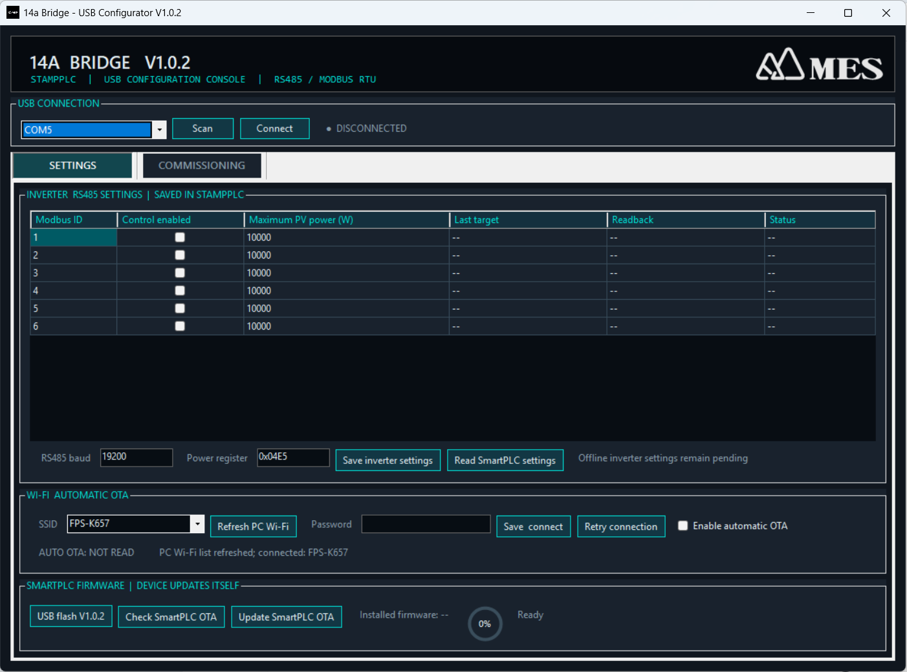
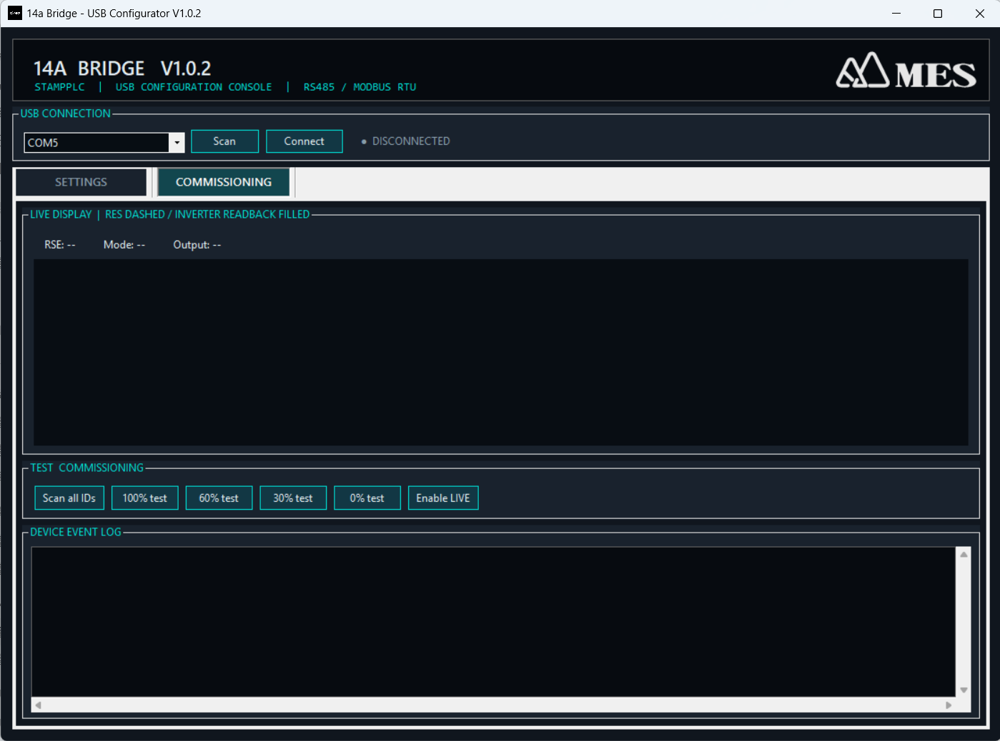
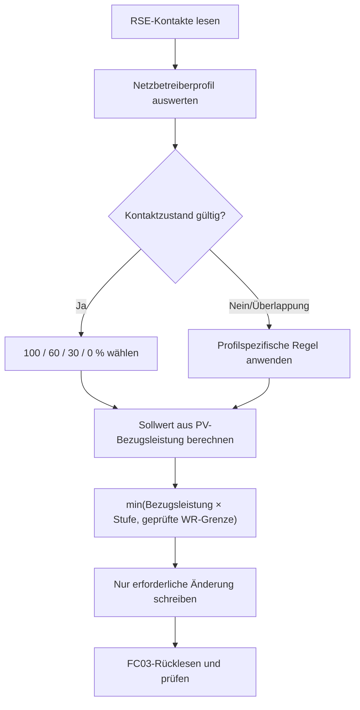

# 14a Bridge

**Deutsch (Standard)** · [English](README.en.md) · [繁體中文](README.zh-TW.md)

Firmware und Windows-USB-Konfigurator für den Einsatz einer M5Stack StampPLC
als Brücke zwischen Rundsteuerempfänger (RSE) und bis zu sechs
Modbus-RTU-Wechselrichtern (IDs 2–7).

Die StampPLC liest potenzialfreie RSE-Relaiskontakte, berechnet für jeden
Wechselrichter den zulässigen Einspeisewert und prüft jede Änderung durch
FC03-Rücklesen. Unveränderte Sollwerte werden nicht ständig neu geschrieben.

> **Geltungsbereich:** Das Gerät dient der Wirkleistungsbegrenzung von
> PV-Erzeugungsanlagen gemäß EEG und den Anschlussregeln des zuständigen
> Netzbetreibers. EnWG §14a betrifft überwiegend steuerbare
> Verbrauchseinrichtungen. Diese Software ersetzt weder die schriftlichen
> Vorgaben des Netzbetreibers noch Abnahme oder Zertifizierung.

[Neueste Version herunterladen](https://github.com/tatsuo25103/14a-bridge/releases/latest)
· [V1.0.7 Versionshinweise](stamplc_14a_bridge/docs/RELEASE_NOTES_V1.0.7.de.md)
· [Ausführliche technische Referenz](stamplc_14a_bridge/README.md)

## 1. Installation

### 1.1 Geprüfte Geräte

- M5Stack StampPLC
- FSP PowerManager Hybrid 10 kW
- FSP PowerManager Hybrid 15 kW
- RSE mit potenzialfreien Relaiskontakten und freigegebener Kontakttabelle

Weitere Modbus-RTU-Wechselrichter müssen vor Einsatz hinsichtlich Register,
Datenbreite, Skalierung und Begrenzungsverhalten geprüft werden.

### 1.2 Windows-Anwendung installieren

1. `14a_Bridge_Setup_V1.0.7.exe` aus den
   [GitHub Releases](https://github.com/tatsuo25103/14a-bridge/releases/latest)
   laden.
2. Setup starten und optional die Desktop-Verknüpfung anlegen.
3. StampPLC per USB-C anschließen.
4. **14a Bridge – USB Configurator** starten.
5. **Scan** wählen. Eine erkannte StampPLC wird automatisch verbunden;
   mehrere Geräte bleiben in der Auswahlliste verfügbar.

### 1.3 Verdrahtung


```text
12-V-DC-Netzteil
  +12 V ---------------- StampPLC VIN+
   0 V ---------------- StampPLC VIN-/GND und Eingangs-COM

RSE, potenzialfreie Kontakte
  Relais-COM ------------ +12 V
  K1 / 100 % ------------ DI1
  K2 /  60 % ------------ DI2
  K3 /  30 % ------------ DI3
  K4 /   0 % ------------ DI4

StampPLC RS485            Wechselrichter RS485
  A ---------------------- A
  B ---------------------- B
  GND -------------------- GND
```

Nur **potenzialfreie** RSE-Kontakte direkt anschließen. Niemals geschaltete
230 V auf einen 5–36-V-DC-Eingang legen. Kontaktzuordnung und gemeinsamer Bezug
müssen dem ausgewählten RSE-Profil und den aktuellen Netzbetreiberunterlagen
entsprechen.

### 1.4 Erstinbetriebnahme

1. Bei neuer StampPLC unter **Settings** mit **USB flash V1.0.7** Bootloader,
   OTA-Partitionen und Firmware installieren. Versorgung nicht unterbrechen.
2. **Read SmartPLC settings** ausführen.
3. RSE-Profil und RS485 (`19200`, Register `0x04E5` für die geprüften
   FSP-Geräte) einstellen.
4. Für IDs 2–7 die gewünschten **Control enabled**-Felder markieren.
5. Die installierte PV-/Bezugsleistung eintragen. Sie darf größer als die
   Wechselrichter-Nennleistung sein.
6. Wechselrichtergrenze prüfen und **Save inverter settings** wählen.
7. Unter **Commissioning** 100/60/30/0 % beaufsichtigt prüfen.
8. Mit **Enable LIVE** auf den realen RSE zurückkehren.

Wenn IDs oder Nennleistungen unbekannt sind, darf **First-time discovery** nur
bei physischem LIVE 100 % oder vor Montage des RSE verwendet werden. Der Scan
ist lesend und speichert erst nach ausdrücklichem **Save inverter settings**.

## 2. Bedienung

### 2.1 Settings



| Bedienelement | Funktion |
|---|---|
| **Scan** | Prüft serielle Ports mit lesender Geräteidentifikation. Fremde Ports werden ignoriert. |
| **First-time discovery** | Lesender Scan der IDs 2–7; übernimmt gefundene Nennwerte vorläufig in die Tabelle. |
| **Save inverter settings** | Speichert IDs, PV-Bezugsleistung, geprüfte Wechselrichtergrenze, RS485 und RSE-Profil. Offline-Geräte bleiben `PENDING`; Eingaben gehen nicht verloren. |
| **Read SmartPLC settings** | Liest die vollständige gespeicherte Konfiguration und den Status neu ein. |
| **Refresh PC Wi-Fi** | Aktualisiert die unter Windows verfügbaren WLAN-Profile. Manuelle SSID-Eingabe bleibt möglich. |
| **Save connect** | Speichert WLAN-Zugangsdaten in der StampPLC und verbindet. |
| **Retry connection** | Verwendet die gespeicherten Zugangsdaten erneut. |
| **Enable automatic OTA** | Aktiviert die geplante Firmwareprüfung der StampPLC. |
| **Save OTA time** | Setzt den Beginn des täglichen 60-Minuten-Wartungsfensters; Standard `01:00` Europe/Berlin. |
| **Sync clock from PC** | Stellt die RTC; bei WLAN erfolgt zusätzlich tägliche NTP-Synchronisation. |
| **USB flash V1.0.7** | Installiert das mitgelieferte Firmwarepaket mit Fortschritt und Schreibprüfung. |
| **Check SmartPLC update** | Prüft signierte SmartPLC-Updates; bei neuer Version folgt eine Bestätigungsfrage. |

### 2.2 Commissioning



| Bedienelement | Funktion |
|---|---|
| **100% / 60% / 30% / 0% test** | Temporärer, beaufsichtigter Test. TEST darf eine strengere physische RSE-Vorgabe nicht aufheben und endet nach fünf Minuten. |
| **Enable LIVE** | Beendet TEST sofort und übernimmt wieder den realen RSE-Eingang. |
| **Live display** | Gestrichelte Linie = RSE-Sollwert; Flüssigkeitsfüllung = bestätigter Istwert; roter Rahmen = qualifizierter Fehler. |
| **Device event log** | Zeigt Befehle, Rücklesewerte, begrenzte Wiederholungen, Erholung, OTA und Diagnose. |

Am LCD bedeutet **LIVE** grün, **TEST** gelb und **OTA** blau. Fehlerhafte
Wechselrichter werden vollständig rot dargestellt. Die Firmware liest
regelmäßig nur den Status; sie schreibt nicht fortlaufend unveränderte Werte.

## 3. Steuerlogik



### 3.1 Leistungsberechnung

```text
Sollwert W = min(PV-/Steuerungs-Bezugsleistung W × RSE-Prozent,
                 geprüfte Wechselrichter-Nennleistung W)
```

Beispiel: 18 kW PV an einem 15-kW-Wechselrichter:

| RSE | Berechnung | Sollwert |
|---:|---:|---:|
| 100 % | 18.000 W | 15.000 W |
| 60 % | 10.800 W | 10.800 W |
| 30 % | 5.400 W | 5.400 W |
| 0 % | 0 W | 0 W |

### 3.2 RSE-Profile

| Profil | Keine Kontakte | Mehrere Kontakte |
|---|---|---|
| **Strict 4-contact (Standard)** | Ungültig, Ausgang unverändert | Ungültig, Ausgang unverändert |
| **Westnetz 4-contact** | 100 % | K1 gibt 100 % frei; sonst stärkste Reduzierung |
| **EWE 4-contact (hold last)** | Letzten gültigen Wert halten | Letzten gültigen Wert halten |
| **VDE FNN / Netze BW 3-contact** | 100 % | Stärkste Reduzierung und Warnung; DI1 muss inaktiv sein |

Das Profil darf nicht durch Ausprobieren gewählt werden. Maßgeblich sind die
schriftlichen Vorgaben des zuständigen Netzbetreibers.

## 4. OTA und Wiederherstellung

Automatische OTA-Installation beginnt nur bei gültiger Uhrzeit, im
konfigurierten Wartungsfenster, bei stabilem physischem 100 %, in LIVE, bei
freiem Modbus und wenn alle aktivierten Wechselrichter am Sollwert bestätigt
sind. Diese Bedingungen werden während des Downloads weiter geprüft.

Manifest und Firmware müssen ECDSA-/SHA-256-geprüft sein. Nach Neustart bleibt
RS485 für 15 Sekunden gesperrt, bis der Selbsttest bestanden ist. Bei Fehler
wird automatisch zur vorherigen gültigen Firmware zurückgekehrt; Einstellungen
in NVS bleiben erhalten.

### Lokale Rückkehr zur vorherigen Firmware

Nach erfolgreicher OTA-Prüfung wird die vorherige Partition zusammen mit ihrer
ELF-SHA-256 gespeichert. **A+C fünf Sekunden halten**, B nicht drücken. Das LCD
zeigt einen kreisförmigen Countdown; B bricht ab. Die Rückkehr wird nur bei
stabilem physischem 100 %, LIVE, freiem Modbus und bestätigten Wechselrichtern
ausgeführt. Anschließend wird AUTO OTA deaktiviert, damit die abgelehnte Version
nicht sofort erneut installiert wird.

## 5. Vorschriften und Hinweise

- [EEG §9](https://www.gesetze-im-internet.de/eeg_2014/__9.html): technische
  Möglichkeit zur ferngesteuerten Einspeiseregelung.
- [EEG §3 Nr. 31](https://www.gesetze-im-internet.de/eeg_2014/__3.html):
  Definition der installierten Leistung.
- [VDE FNN Schnittstellenhinweis](https://www.vde.com/resource/blob/2352664/6599b9aad89846ca5f668ad5f4fc9e64/vde-fnn-hinweis-schnittstellen-steuerungseinrichtung-data.pdf):
  Beispiel der Drei-Kontakt-Schnittstelle.

Netzbetreiberprofil, Leistungsbasis, Relaisverdrahtung und Inbetriebnahme sind
für jeden Standort zu dokumentieren und zu bestätigen. Softwarekonformität
allein ist keine elektrische Abnahme oder rechtliche Zertifizierung.

## 6. Versionen

V1.0.7 ergänzt gehärtetes OTA-Rollback, ELF-SHA-256-Bindung der
Sicherungspartition, lokalen A+C-Countdown, zusätzliche Rückkehr-Sicherheits-
bedingungen und korrigierte OTA-Statusmeldungen. Frühere Versionen bleiben auf
der [Release-Seite](https://github.com/tatsuo25103/14a-bridge/releases)
verfügbar.
