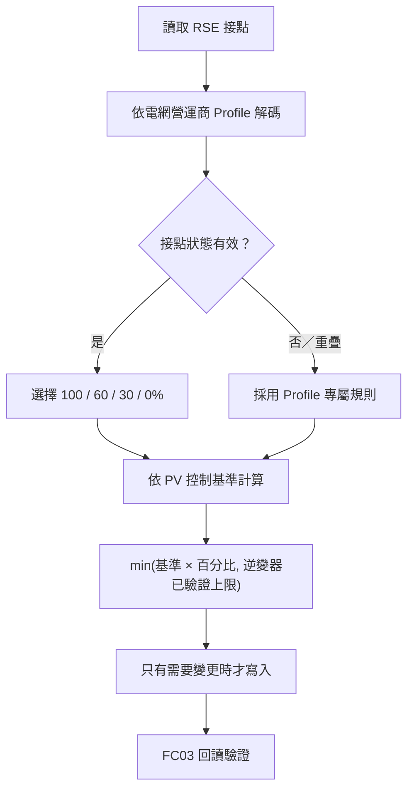

# 14a Bridge

[Deutsch（預設）](README.md) · [English](README.en.md) · **繁體中文**

本專案包含 M5Stack StampPLC 韌體及 Windows USB 設定工具，用來橋接
Rundsteuerempfänger（RSE）與最多六台 Modbus RTU 逆變器（ID 2–7）。

StampPLC 讀取 RSE 的無電位繼電器接點，依每台逆變器的 PV 裝機／控制基準
功率計算限制值，寫入後以 FC03 回讀驗證；目標沒有改變時不會持續重複寫入。

> **適用範圍：**本產品依 EEG 與所選配電網營運商的接點表控制 PV 饋電。
> EnWG §14a 主要規範熱泵、充電設備與儲能等可控用電設備。本專案不是法律
> 認證，也不能取代當地電網營運商的書面要求、電氣驗收或併網許可。

[下載最新版本](https://github.com/tatsuo25103/14a-bridge/releases/latest)
· [V1.0.7 版本說明](stamplc_14a_bridge/docs/RELEASE_NOTES_V1.0.7.zh-TW.md)
· [完整技術文件（英文）](stamplc_14a_bridge/README.md)

## 1. 安裝

### 1.1 已驗證相容設備

- M5Stack StampPLC
- FSP PowerManager Hybrid 10 kW
- FSP PowerManager Hybrid 15 kW
- 具有無電位繼電器接點，且接點表經現場核准的 RSE

其他 Modbus RTU 逆變器必須先驗證暫存器、資料寬度、縮放及限制行為，才能使用。

### 1.2 安裝 Windows 程式

1. 從 [GitHub Releases](https://github.com/tatsuo25103/14a-bridge/releases/latest)
   下載 `14a_Bridge_Setup_V1.0.7.exe`。
2. 執行安裝程式，可選擇建立桌面捷徑。
3. 以 USB-C 連接 StampPLC。
4. 啟動 **14a Bridge – USB Configurator**。
5. 按 **Scan**。只找到一台 SmartPLC 時會自動連線；找到多台時仍可選擇。

### 1.3 接線


```text
DC 12 V 電源
  +12 V ---------------- StampPLC VIN+
   0 V ---------------- StampPLC VIN-/GND 與輸入 COM

RSE 無電位接點
  繼電器 COM ----------- +12 V
  K1 / 100% ------------ DI1
  K2 /  60% ------------ DI2
  K3 /  30% ------------ DI3
  K4 /   0% ------------ DI4

StampPLC RS485           逆變器 RS485
  A --------------------- A
  B --------------------- B
  GND ------------------- GND
```

只能把 **無電位接點**直接接入 StampPLC。絕不可把切換後的 230 V 接到
5–36 V DC 輸入。接點定義與共地方式必須符合所選 RSE Profile 及電網營運商
最新文件。

### 1.4 第一次裝機

1. 新 StampPLC 在 **Settings** 按 **USB flash V1.0.7**，寫入 Bootloader、
   OTA 分割區及韌體；過程中不可斷電或拔除 USB。
2. 按 **Read SmartPLC settings**。
3. 選擇 RSE Profile；已驗證的 FSP 設備使用 RS485 `19200`、暫存器 `0x04E5`。
4. 在 ID 2–7 勾選實際要控制的 **Control enabled**。
5. 填寫 PV 裝機／控制基準功率；此值可以大於逆變器額定功率。
6. 確認逆變器上限後按 **Save inverter settings**。
7. 到 **Commissioning** 在人員監督下測試 100/60/30/0%。
8. 按 **Enable LIVE** 回到實體 RSE 控制。

不知道逆變器 ID 或額定功率時，只有在實體 LIVE 100%，或 RSE 尚未安裝的
第一次裝機階段，才可使用 **First-time discovery**。掃描只讀；按下
**Save inverter settings** 前不會保存結果。

## 2. GUI 操作

### 2.1 Settings


| 按鈕／欄位 | 功能 |
|---|---|
| **Scan** | 對串列埠送出唯讀身分查詢；其他設備的 COM Port 會被忽略。 |
| **First-time discovery** | 唯讀掃描 ID 2–7，暫時把找到的額定功率填入表格。 |
| **Save inverter settings** | 保存啟用 ID、PV 基準、已驗證逆變器上限、RS485 與 RSE Profile；離線設備保留為 `PENDING`，不會取消設定。 |
| **Read SmartPLC settings** | 重新讀取控制器內完整設定及狀態；修改前與保存後都應執行。 |
| **Refresh PC Wi-Fi** | 更新電腦可取得的 Wi-Fi Profile；仍可手動輸入 SSID。 |
| **Save connect** | 把 Wi-Fi 帳密保存到 StampPLC 並嘗試連線。 |
| **Retry connection** | 不修改帳密，重新使用已保存的 Wi-Fi 設定。 |
| **Enable automatic OTA** | 啟用 StampPLC 排程韌體檢查。 |
| **Save OTA time** | 設定每日 60 分鐘維護時窗的開始時間；預設 Europe/Berlin `01:00`。 |
| **Sync clock from PC** | 用電腦校正 RTC；連網後每天也會以 NTP 校時。 |
| **USB flash V1.0.7** | 寫入安裝包內的正式韌體，顯示進度並驗證寫入結果。 |
| **Check SmartPLC update** | 檢查簽章韌體；確定有新版時才詢問是否更新。 |

### 2.2 Commissioning


| 按鈕／顯示 | 功能 |
|---|---|
| **100% / 60% / 30% / 0% test** | 暫時測試值；不可解除更嚴格的實體 RSE 限制，五分鐘後自動失效。 |
| **Enable LIVE** | 立即清除 TEST，重新採用實體 RSE。 |
| **Live display** | 虛線是 RSE 目標；液體填滿度是逆變器回讀；整框紅色代表已確認錯誤。 |
| **Device event log** | 顯示指令、回讀、有限次重試、恢復、OTA 與診斷事件。 |

LCD 右上角狀態：**LIVE 綠色**、**TEST 黃色**、**OTA 藍色**。韌體會定期
唯讀確認逆變器是否恢復，不會頻繁重寫相同限制值。

## 3. 控制邏輯



### 3.1 功率計算

```text
目標 W = min(PV／控制基準功率 W × RSE 百分比,
             已驗證逆變器額定上限 W)
```

例：18 kW PV 搭配 15 kW 逆變器：

| RSE | 基準計算 | 寫入目標 |
|---:|---:|---:|
| 100% | 18,000 W | 15,000 W |
| 60% | 10,800 W | 10,800 W |
| 30% | 5,400 W | 5,400 W |
| 0% | 0 W | 0 W |

### 3.2 RSE Profile

| Profile | 沒有接點 | 兩個以上接點 |
|---|---|---|
| **Strict 4-contact（預設）** | 無效，輸出保持不變 | 無效，輸出保持不變 |
| **Westnetz 4-contact** | 100% | K1 優先釋放 100%；沒有 K1 時採最嚴格限制 |
| **EWE 4-contact (hold last)** | 保持最後有效值 | 保持最後有效值 |
| **VDE FNN / Netze BW 3-contact** | 100% | 採最嚴格限制並記錄警告；DI1 必須保持無效 |

不可用嘗試方式選擇 Profile，必須依當地電網營運商的書面規定設定。

## 4. OTA 與回復

自動 OTA 只有在 RTC 有效、位於設定維護時窗、實體 RSE 穩定 100%、LIVE、
Modbus 閒置，且所有啟用逆變器都已確認達到目標時才會安裝。下載期間持續檢查，
任一條件改變即中止，保留原韌體。

Manifest 必須通過 ECDSA 簽章，韌體必須符合 SHA-256。新版第一次開機時，
RS485 暫停 15 秒直到自檢成功；自檢、重啟或啟用失敗會自動回到上一個有效版本。
逆變器、PV、RS485、Wi-Fi、RSE Profile 及 OTA 設定保存於 NVS。

### 本機回到上一版

OTA 驗證成功後，上一個分割區會綁定其 ELF SHA-256。保持 B 未按，**A+C 同時
長按五秒**；LCD 顯示圓形倒數，按 B 可取消。只有在實體 100%、LIVE、Modbus
閒置且所有逆變器正常時才允許回復。成功回復後 AUTO OTA 會關閉，避免被拒絕
的版本立即再次安裝。沒有備份、紀錄過期或分割區被覆寫時不會重啟。

## 5. 規範與注意事項

- [EEG §9](https://www.gesetze-im-internet.de/eeg_2014/__9.html)：遠端控制
  饋電功率的技術能力。
- [EEG §3 Nr. 31](https://www.gesetze-im-internet.de/eeg_2014/__3.html)：
  裝機功率定義。
- [VDE FNN 介面指南](https://www.vde.com/resource/blob/2352664/6599b9aad89846ca5f668ad5f4fc9e64/vde-fnn-hinweis-schnittstellen-steuerungseinrichtung-data.pdf)：
  三接點控制介面範例。

每個案場都必須確認電網營運商 Profile、功率基準、繼電器接線及調試結果。
軟體功能符合設計不等於完成電氣驗收、併網核准或法律認證。

## 6. 版本

V1.0.7 新增強化 OTA 回復、以 ELF SHA-256 綁定備份分割區、A+C 圓形倒數、
回復安全條件，以及 OTA 狀態修正。舊版會繼續保留在
[Releases](https://github.com/tatsuo25103/14a-bridge/releases)。
