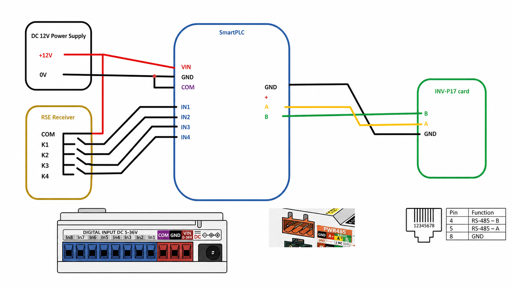
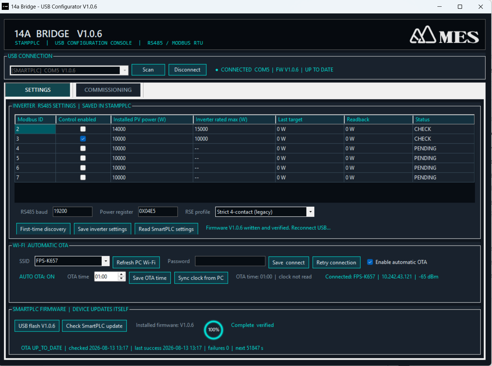
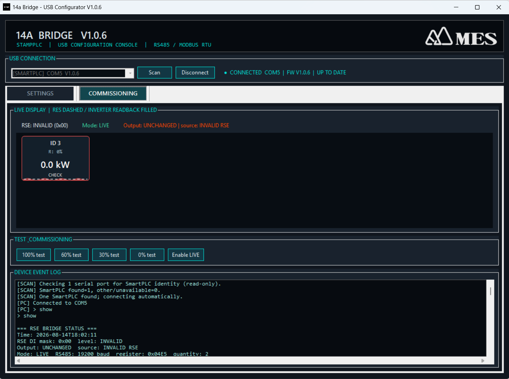

# 14a Bridge

M5Stack StampPLC firmware and a Windows USB Configurator for bridging a
ripple-control receiver (`Rundsteuerempfänger`, RSE) to up to six
P17/InfiniSolar inverters over Modbus RTU.

The RSE decodes the grid operator's ripple-control signal. The StampPLC reads
the RSE relay contacts, calculates an individual watt limit for every enabled
inverter, writes that value only when a control command changes, and verifies
the result by readback.

> [!CAUTION]
> Installation must be performed by a qualified person. Never connect a
> switched 230 V RSE output directly to the StampPLC 5-36 V DC inputs. Use
> potential-free contacts or correctly rated interface relays. The selected
> RSE profile and terminal assignment must match the written requirements of
> the responsible grid operator.

## Contents

1. [Installation](#1-installation)
2. [Operation and GUI controls](#2-operation-and-gui-controls)
3. [Technical reference and supplementary information](#3-technical-reference-and-supplementary-information)
4. [Release history](#4-release-history)

Quick guides are also available separately:

- [English quick start](docs/QUICK_START_en.md)
- [Traditional Chinese quick start](docs/QUICK_START_zh-TW.md)
- [GitHub releases and Windows installer](https://github.com/tatsuo25103/14a-bridge/releases)

---

# 1. Installation

## 1.1 Required equipment

- M5Stack StampPLC
- isolated SELV/PELV 12 V DC power supply
- RSE with potential-free relay contacts, or suitable interface relays
- one to six compatible inverters using Modbus IDs `2-7`
- RS485 cable and a USB Type-C data cable
- Windows 10 or Windows 11 computer for initial configuration

A 12 V / 1 A supply is sufficient for the StampPLC itself. Use approximately
2-2.5 A when the same supply also powers interface relays or other equipment.

### Verified compatible inverter models

The current firmware and Windows Configurator have been adapted and verified
for the following equipment:

- **FSP PowerManager Hybrid 10 kW**
- **FSP PowerManager Hybrid 15 kW**

Compatibility assumes the inverter uses the tested Modbus register map and
communication settings. Other Modbus RTU models must be verified for register
address, data format, byte order, and write/readback behaviour before use.

## 1.2 Install the Windows application

1. Open the [latest GitHub release](https://github.com/tatsuo25103/14a-bridge/releases).
2. Download `14a_Bridge_Setup_V1.0.6.exe`.
3. Run the installer and start **14a Bridge - USB Configurator**.
4. Connect the StampPLC to the PC with a USB Type-C **data** cable.

The installer contains the GUI, the matching firmware, and a self-contained
ESP32-S3 flasher. Customers do not need Python, PlatformIO, or other
development tools.

## 1.3 Wire the system



### Configurator screens used during installation





### Power and RSE terminals

| Source | StampPLC terminal | Function |
|---|---|---|
| 12 V `+` | `VIN` | StampPLC supply positive |
| 12 V `0 V` | `GND` | StampPLC supply return |
| 12 V `0 V` | `COM` | Digital-input common reference |
| 12 V `+` | RSE relay `COM` | Supplies 12 V through the selected RSE contact |
| RSE `K1` | `IN1` | 100% command in the default profile |
| RSE `K2` | `IN2` | 60% command in the default profile |
| RSE `K3` | `IN3` | 30% command in the default profile |
| RSE `K4` | `IN4` | 0% command in the default profile |

`GND` powers the StampPLC. `COM` is the reference for the digital inputs. When
the StampPLC is powered through USB during bench testing, the external 12 V
supply `0 V` may be connected to `COM` for the input circuit; for the final
12 V installation, connect the supply return as shown in the diagram.

### RS485 terminals

| StampPLC PWR485 | Inverter | Function |
|---|---|---|
| `A` | `A` | RS485 A / D+ |
| `B` | `B` | RS485 B / D- |
| `GND` | `GND` | Signal reference when required by the inverter installation |

The PWR485 power pin is connected to StampPLC `VIN` and therefore carries
12 V. Normally connect only RS485 `A`, `B`, and the required signal reference.
Do not connect the PWR485 power pin to the inverter unless its documentation
explicitly requires that voltage.

## 1.4 Identify and connect the StampPLC

1. Click **Scan**.
2. The GUI performs a read-only identity check on every Windows serial port.
3. If exactly one StampPLC is found, the GUI connects automatically.
4. If several StampPLC devices are found, select the required
   `[SMARTPLC] COMx Vx.x.x` entry and click **Connect**.
5. Confirm that the connection line shows the COM port, installed firmware,
   and `UP TO DATE` or `UPDATE AVAILABLE`.

Unrelated serial devices are listed but are not opened as a SmartPLC. This
prevents the GUI from sending controller commands to other COM-port devices.

## 1.5 Flash a new or unprogrammed StampPLC

Use this step for a new controller, a controller without identifiable
firmware, or a device that must receive the current USB firmware package.

1. Select its COM port.
2. Open **SETTINGS**.
3. Click **USB flash V1.0.6**.
4. Confirm the selected port.
5. Keep USB power connected until the circular indicator reaches `100%` and
   the GUI reports `Complete & verified`.
6. Wait for the device to restart; the GUI scans and reconnects automatically.

USB flashing writes the bootloader, OTA partition layout, and application,
then verifies every written region. It does not write a power value to an
inverter. Existing settings remain in the unchanged NVS storage area.

## 1.6 Configure inverter and RS485 settings

Open **SETTINGS** and configure the table for Modbus IDs `2-7`.

| Field | What to enter |
|---|---|
| **Modbus ID** | Fixed inverter address, from 2 to 7 |
| **Control enabled** | Check only IDs that this StampPLC must control |
| **Installed PV power (W)** | Total installed PV module capacity for that inverter, in watts |
| **Inverter rated max (W)** | Verified maximum feed-in limit read from or confirmed for the inverter |
| **Last target** | Last watt command calculated by the StampPLC; display only |
| **Readback** | Current value read from the inverter register; display only |
| **Status** | `OK`, `CHECK`, `PENDING`, warning, or error state |

Then confirm:

- **RS485 baud**: default `19200`; it must match every inverter on the bus.
- **Power register**: default `0x04E5`; change only when the inverter's verified
  register map requires a different address.
- **RSE profile**: select the contact table specified by the grid operator.

### Option A: known inverter IDs and ratings

1. Check the required IDs.
2. Enter the installed PV power and inverter rated maximum for each ID.
3. Click **Save inverter settings**.
4. Click **Read SmartPLC settings** and confirm the saved values and status.

### Option B: first-time discovery

Use **First-time discovery** only during initial installation when the IDs and
ratings are unknown.

1. Ensure all inverters are powered, assigned unique IDs `2-7`, and currently
   hold their full-power limit.
2. Keep the controller in **LIVE**.
3. Set the physical RSE to 100%, or use this only while the RSE is not yet
   installed/valid and every inverter is known to be at full power.
4. Click **First-time discovery** and confirm the warning.
5. Review the detected IDs, installed PV power, and rated maximum.
6. Correct any value that is not the actual installation value.
7. Click **Save inverter settings**. Discovery results are not saved before
   this button is pressed.

Discovery is read-only. It is blocked at physical 0%, 30%, or 60%, and during
TEST, because a reduced register value cannot identify an inverter's full
rating. For a newly discovered unit, the read value is used only as an initial
preset for both power fields.

## 1.7 Configure Wi-Fi, clock, and automatic OTA

Wi-Fi is optional and is used only for NTP time synchronization and outbound
GitHub firmware updates. The controller does not open a Wi-Fi access point or
an inbound network service.

1. Click **Refresh PC Wi-Fi** and select an SSID, or type the SSID manually.
2. Enter the Wi-Fi password.
3. Click **Save & connect**.
4. Confirm the connected SSID, IP address, and RSSI shown at the right.
5. Click **Sync clock from PC** once during commissioning.
6. Select a verified non-daylight OTA start time; the default is `01:00`.
7. Click **Save OTA time**.
8. Enable **Enable automatic OTA** only if unattended SmartPLC updates are
   required, then confirm that the GUI shows `AUTO OTA: ON`.

When Wi-Fi is available, the StampPLC also synchronizes Europe/Berlin time by
NTP after startup and once per day. Time synchronization updates the RTC; it
does not repeatedly write inverter settings.

## 1.8 Commission and hand over

1. Open **COMMISSIONING** and inspect the physical RSE state.
2. Confirm the selected RSE profile and exercise every expected contact state.
3. Under supervision, use the four TEST buttons and verify each enabled
   inverter's readback.
4. Click **Enable LIVE** to clear TEST and return to the physical RSE.
5. Confirm that each enabled tile becomes `OK` and that the inverter output
   follows 100%, 60%, 30%, and 0% as required.
6. Test restoration to 100%, loss and restoration of RS485, power cycling, and
   invalid RSE input combinations before handover.

---

# 2. Operation and GUI controls

## 2.1 USB connection bar

| Control | How to use it |
|---|---|
| **Port list** | Shows identified SmartPLC devices first. With multiple devices, select the intended COM port. |
| **Scan** | Rechecks all serial ports using read-only identity requests. One identified SmartPLC connects automatically. |
| **Connect** | Opens the selected identified SmartPLC. It changes to **Disconnect** while connected. |
| **Disconnect** | Closes the current USB session. The StampPLC continues controlling the inverters independently. |
| **Connection status** | Shows COM port, firmware version, and whether a newer bundled firmware is available. |

The Windows application is a configurator and monitor. Normal RSE control
continues even when the GUI is closed or USB is disconnected.

## 2.2 SETTINGS tab

### Inverter and RS485 buttons

| Button | Function |
|---|---|
| **First-time discovery** | Read-only scan of IDs 2-7. It presets detected full-power values in the table but does not save them. Use only at LIVE 100% or before the RSE is installed, with all inverters at full power. |
| **Save inverter settings** | Validates the table, saves enabled IDs, PV power, verified inverter maximum, RS485 settings, and RSE profile to StampPLC NVS. Online units are verified using bounded Modbus write/readback; offline or unsafe rows remain `PENDING` instead of being discarded. |
| **Read SmartPLC settings** | Reloads the complete saved inverter, RS485, RSE profile, Wi-Fi, clock, firmware, and OTA state from the connected controller. Use this before editing and again after saving. |

The installed PV power may legitimately exceed the inverter rating. The GUI
keeps that value and marks the cell with a yellow warning. It does not force
the PV capacity down to the inverter rating; only the final Modbus target is
capped.

### Wi-Fi and automatic OTA buttons

| Control | Function |
|---|---|
| **SSID** | Select a network detected/saved on the PC, or type its name manually. |
| **Refresh PC Wi-Fi** | Reloads current and saved Wi-Fi profile names from Windows. If Windows Location access is disabled, the current SSID may be hidden but manual entry still works. |
| **Password** | Enter the Wi-Fi password. It must be empty for an open network or contain 8-63 UTF-8 bytes. |
| **Save & connect** | Saves SSID/password in the StampPLC and immediately attempts a connection. |
| **Retry connection** | Reuses the saved credentials without changing them. |
| **Enable automatic OTA** | Enables or disables the SmartPLC's own scheduled update client. The nearby text must confirm `AUTO OTA: ON` or `OFF`. |
| **OTA time** | Selects the start of the daily 60-minute maintenance window. Default: `01:00-01:59`. |
| **Save OTA time** | Saves the selected maintenance-window start time. |
| **Sync clock from PC** | Copies the PC's local date and time to the StampPLC RTC immediately. |

### Firmware buttons and indicators

| Control | Function |
|---|---|
| **USB flash V1.0.6** | Installs the bundled firmware through USB and verifies the written flash. Intended for first installation, recovery, or migration to the OTA partition layout. Keep power connected. |
| **Check SmartPLC update** | Asks the SmartPLC to check GitHub. If a newer firmware is available, the GUI asks whether to install it. If none is available, no installation occurs. |
| **Installed firmware** | Shows the version reported by the connected controller. |
| **Circular progress indicator** | Shows preparation, write/download percentage, verification, completion, or failure. |
| **OTA diagnostics** | Shows the last check, last success, failure count, next retry, and latest OTA error. |

SmartPLC firmware OTA and Windows GUI updates are separate. A SmartPLC OTA
updates the controller. A newer Windows GUI is reported quietly in the
connection area and does not change the controller by itself.

## 2.3 COMMISSIONING tab

### Live display

| Item | Meaning |
|---|---|
| **RSE** | Physical input level and raw DI mask. `INVALID` means the selected profile does not accept the current combination. |
| **Mode** | `LIVE` in green for physical RSE control, `TEST` in amber for a temporary GUI test, or `OTA` in blue while updating. |
| **Output** | Last applied output result and its source. `UNCHANGED` means the previous verified inverter setting was deliberately retained. |
| **Dashed line** | RSE/RES target percentage for the tile. |
| **Liquid fill** | Current inverter readback level. Its color follows the active RSE percentage. |
| **Tile value** | Current inverter value in kW. |
| **Tile border/status** | Normal status, amber transient warning, or full red tile after a confirmed inverter fault. |

The same tank-style display is shown on the StampPLC LCD. The layout adapts
automatically to one through six enabled inverters.

### Test and commissioning buttons

| Button | Function |
|---|---|
| **100% test** | Temporarily requests the calculated 100% target. In LIVE, it is rejected if it would relax a more restrictive physical RSE command. |
| **60% test** | Temporarily requests 60% of installed PV power, capped by the verified inverter maximum. |
| **30% test** | Temporarily requests 30% of installed PV power, capped by the verified inverter maximum. |
| **0% test** | Temporarily requests zero feed-in. |
| **Enable LIVE** | Clears the GUI test value and immediately reloads the actual physical RSE input for normal control. |

TEST is a commissioning aid, not a permanent operating mode. It expires after
five minutes and returns to LIVE automatically. A physical RSE transition also
ends TEST immediately. A live TEST may make the output more restrictive but
can never release or bypass an active physical reduction.

### Device event log

The log shows USB commands, RSE transitions, Modbus write/readback results,
periodic health checks, recovery events, discovery, flashing, and OTA
diagnostics. It is the first place to inspect when a tile is amber or red.

## 2.4 Normal daily operation

After commissioning, the GUI does not need to remain open:

1. The StampPLC continuously reads the RSE inputs.
2. A valid changed RSE command is debounced and converted to a watt target for
   every enabled inverter.
3. Each target is written sequentially and verified by FC03 readback.
4. If the RSE command does not change, the controller does not repeatedly
   rewrite the same value.
5. Periodic round-robin FC03 reads check current state without writing flash or
   inverter settings.
6. A recovered inverter is detected automatically and its display/status is
   refreshed.

---

# 3. Technical reference and supplementary information

## 3.1 Power calculation

The legal/contractual percentage is applied to **installed PV module power**,
not automatically to inverter nameplate power. The final target is capped by
the separately verified inverter limit:

```text
target W = min(round(installed PV W × RSE percentage), verified inverter limit W)
```

Example: 18,000 Wp of PV modules connected to a 15,000 W inverter.

| RSE level | Calculation | Target written |
|---:|---|---:|
| 100% | min(18,000 × 1.00, 15,000) | 15,000 W |
| 60% | min(18,000 × 0.60, 15,000) | 10,800 W |
| 30% | min(18,000 × 0.30, 15,000) | 5,400 W |
| 0% | 0 | 0 W |

Integer nearest-watt calculation avoids the display/write discrepancy caused
by repeated floating-point conversion.

## 3.2 RSE profiles

Select the profile required by the responsible grid operator. Do not choose a
profile by trial and error.

| GUI profile | Input assignment | No contact | Multiple contacts |
|---|---|---|---|
| **Strict 4-contact (legacy)** — default | DI1/2/3/4 = 100/60/30/0% | Invalid; output unchanged | Invalid; output unchanged |
| **Westnetz 4-contact** | DI1/2/3/4 = K1/K2/K3/K4 | 100% | K1 releases to 100%; otherwise most restrictive wins |
| **EWE 4-contact (hold last)** | DI1/2/3/4 = 100/60/30/0% | Hold last valid level | Hold last valid level |
| **VDE FNN / Netze BW 3-contact** | DI2/3/4 = 60/30/0%; DI1 unused | 100% | Most restrictive reduction wins; warning logged |

The selected fixed truth table evaluates every DI1-DI4 mask. The firmware
does not guess the grid operator or silently switch profiles.

## 3.3 Status and fault handling

| Status | Meaning and action |
|---|---|
| **OK** | The inverter answered and its readback is valid. |
| **CHECK** | Configuration/readback needs attention or a transient fault has not yet met the confirmed-error threshold. Inspect the log. |
| **PENDING** | The setting is saved, but cannot yet be safely verified because the inverter is offline or physical LIVE 100% is unavailable. The ID stays excluded from control until verified. |
| **Amber tile/border** | One or two consecutive health reads failed; the last good value is retained while the controller retries later. |
| **Red ERROR tile** | Three consecutive periodic health reads failed, or a confirmed control/readback error exists. Check power, ID, baud rate, A/B polarity, cabling, and termination. |

A single successful read immediately restores the current value and clears a
transient communication fault.

## 3.4 Modbus write protection and inverter lifetime

- Control uses sequential FC16 write followed by FC03 verification.
- A failed control transaction retries the complete write/readback sequence up
  to three times with increasing backoff.
- Retries are bounded; they do not continue without limit in the background.
- Enabled IDs are separated by 500 ms to reduce bus collisions and inverter load.
- Periodic monitoring is FC03 read-only, one inverter at a time.
- The same power limit is not continuously rewritten when the RSE state has
  not changed.
- An externally changed limit is detected but is not automatically written
  back until a new RSE transition or explicit confirmed command occurs.

These rules separate communication health from control conformance and avoid
unnecessary writes to inverter non-volatile memory.

## 3.5 OTA safety and recovery

Automatic OTA is off by default. When enabled, the controller checks only in
its configured 60-minute daily window. Installation begins only when:

- Wi-Fi is connected and the clock is valid;
- the physical RSE is stable at 100%;
- TEST is inactive;
- Modbus control is idle; and
- every enabled inverter is verified and ready.

The conditions are checked again during download. If any condition becomes
unsafe, the update is aborted and waits for a later window. Firmware is
downloaded over certificate-validated HTTPS and accepted only when its SHA-256
matches the signed release manifest. Two application slots allow first-boot
validation and automatic rollback if the new application cannot confirm a
healthy startup. Saved inverter, RS485, RSE profile, Wi-Fi, clock, and OTA
settings remain in NVS across a normal update or rollback.

Keep the configured OTA window within a verified non-daylight period for the
installation location. The default `01:00` is a time-based maintenance window,
not an astronomical sunrise/sunset calculation.

## 3.6 LCD and indicators

- **LIVE**: green; normal physical RSE control.
- **TEST**: amber; temporary GUI commissioning value.
- **OTA**: blue; firmware checking, downloading, verifying, or installing.
- The LCD divides into 1, 2, 3, 4, 5, or 6 tiles according to enabled IDs.
- The dashed level shows the RSE target; animated liquid shows inverter
  readback. Text remains centered and a confirmed failed inverter uses a full
  red tile.
- The RGB alarm and buzzer provide local fault indication.

## 3.7 Logging and fallback USB commands

The GUI uses the same text protocol available through a 115200-baud USB serial
terminal:

| Command | Purpose |
|---|---|
| `help` | List available commands |
| `show` | Read controller state and saved settings |
| `probe all` | FC03 read-only probe of all enabled IDs |
| `probe 3` | FC03 read-only probe of ID 3 |

Probe commands never write an inverter value. When a FAT32 microSD card is
available, CSV logging records time, RSE mask, percentage, inverter ID,
configured power, requested watts, readback watts, and result.

## 3.8 Developer build and release assets

```powershell
cd stamplc_14a_bridge
..\.venv\Scripts\platformio.exe run
..\.venv\Scripts\platformio.exe run -t upload
..\.venv\Scripts\platformio.exe device monitor
```

Every OTA-capable GitHub release must include:

- `14a_bridge_firmware.bin`
- `ota_manifest.json`

Maintainers must follow the [production release checklist](docs/RELEASE_PROCESS.md).

---

# 4. Release history

## V1.0.6 — RSE profiles and commissioning safety

- Added four selectable RSE truth tables.
- Made the physical RSE authoritative during live TEST.
- Added safe pending configuration and LIVE-100% inverter verification.
- Restricted OTA installation to a stable, safe operating state.
- Preserved earlier schema settings through migration.

See [V1.0.6 release notes](docs/RELEASE_NOTES_V1.0.6.md).

## V1.0.5 — Explicit operating states and scheduled OTA

- Added green LIVE, amber TEST, and blue OTA states.
- Added the five-minute TEST timeout and immediate return on physical RSE
  transition.
- Added configurable daily OTA time and PC/NTP clock synchronization.
- Added IDs 2-7 with separate installed PV power and inverter rated maximum.

## V1.0.4 — Production OTA and serial-port identification

- Added signed manifests, primary/backup downloads, bounded retry, persistent
  diagnostics, first-boot validation, and rollback support.
- Added automatic SmartPLC serial-port identification.
- Added dedicated OTA display and progress reporting.

Earlier tagged releases remain available on the
[GitHub Releases page](https://github.com/tatsuo25103/14a-bridge/releases).
